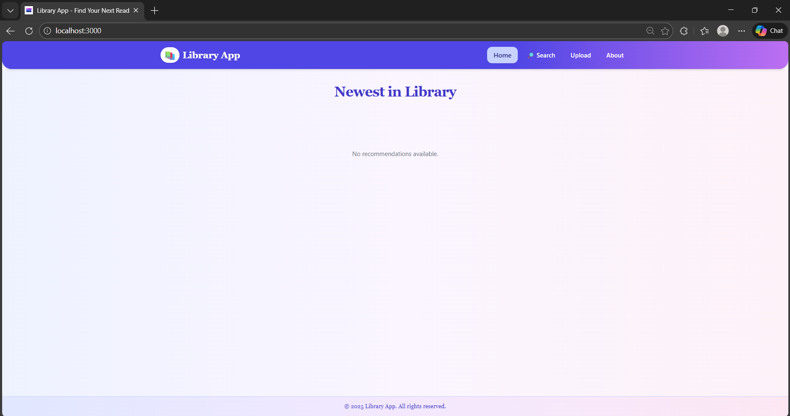
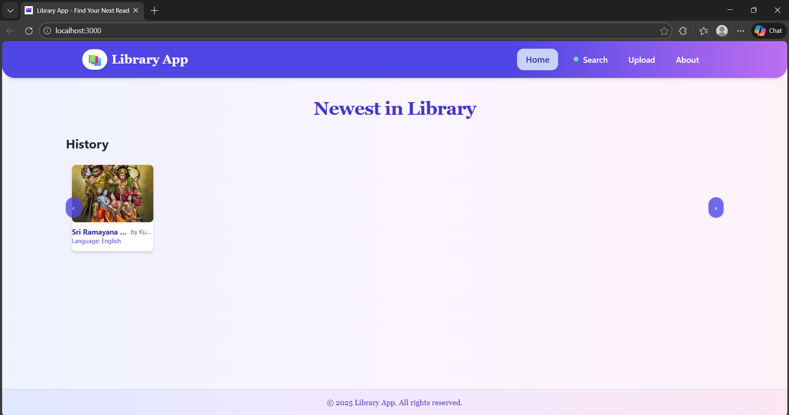
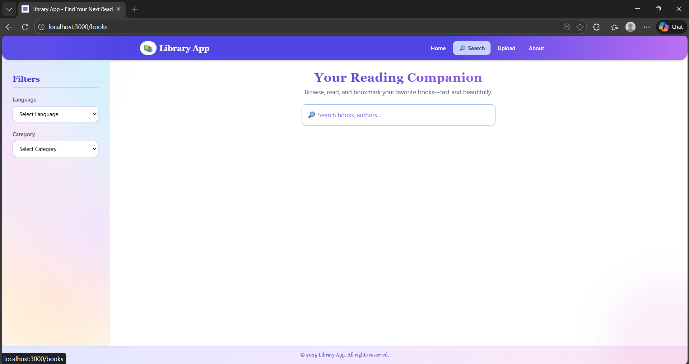
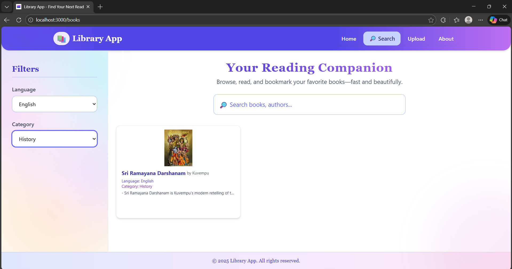
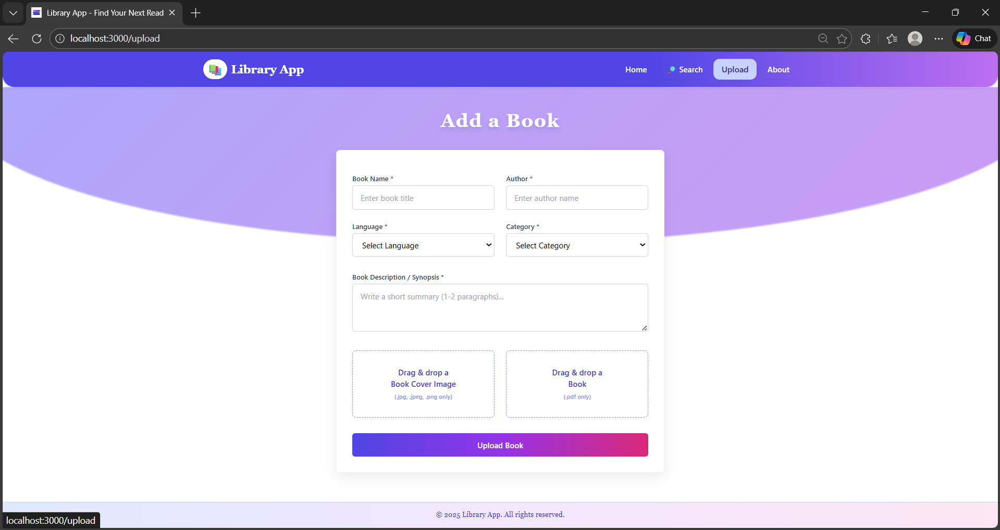
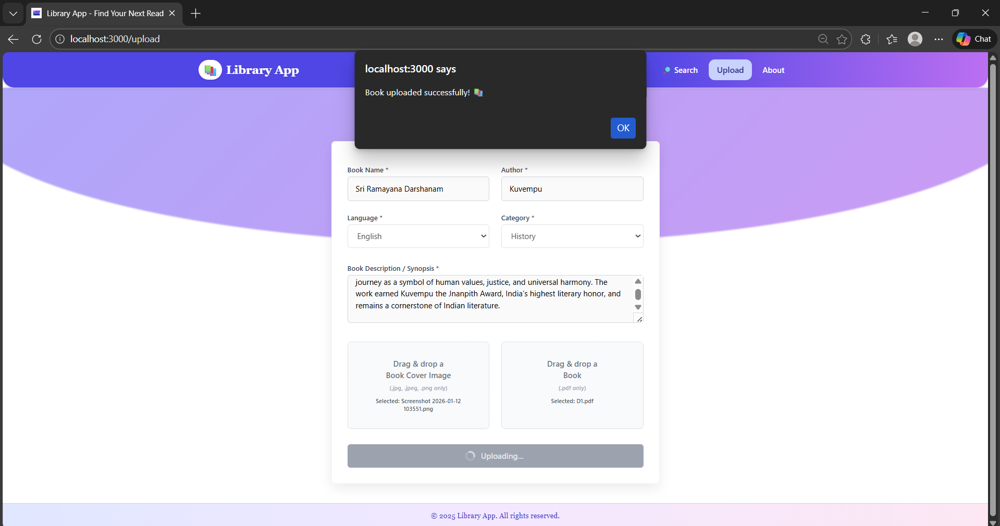
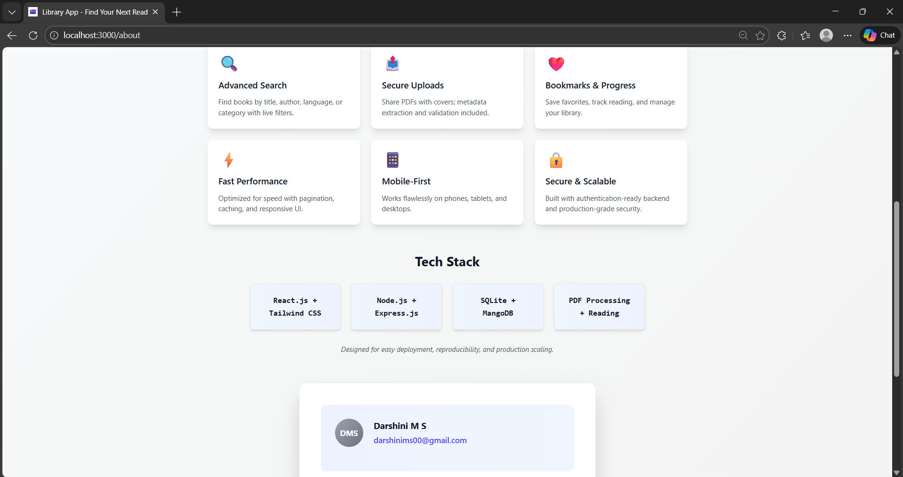
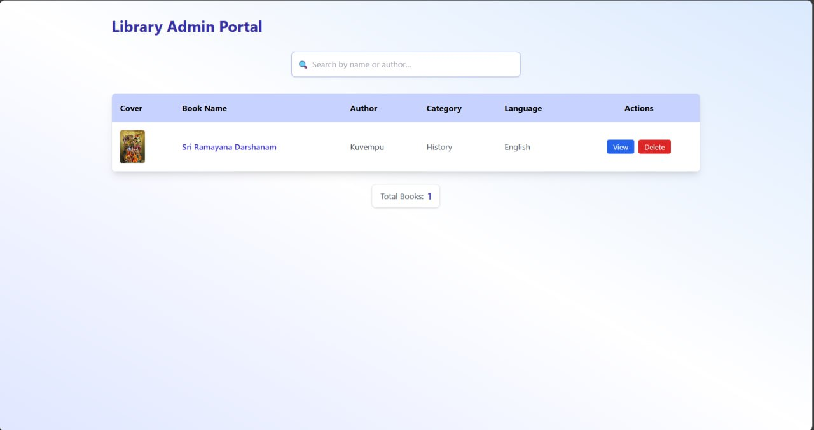

# 📚 ELibrary App

A modern, accessible digital library built with **Node.js, Express, MongoDB, and React**.  
The app allows users to **search, upload, and browse books** with a clean UI and secure backend, plus an **Admin Panel** for managing content.

👉 Live Demo: https://elibrary-app-phi.vercel.app/

---

## 🚀 Features
- 🔍 **Search & Browse** books by title, author, language, or category  
- 📑 **Bookmark Favorites** and track reading progress  
- 📤 **Upload Books** with cover images and PDFs  
- 📱 **Responsive Design** (mobile‑friendly)  
- 🛠️ **Admin Dashboard** for managing books and users  
- 🔒 **Secure Backend** with pinned dependencies and audit fixes  

---

## 🛠️ Tech Stack
- **Frontend (User):** React, TailwindCSS, React Router  
- **Frontend (Admin):** React, TailwindCSS, Axios, React Router  
- **Backend:** Node.js, Express, MongoDB  
- **Deployment:** Vercel (frontend), Node server (backend)  
- **Tools:** Multer (secure version), npm audit for vulnerability fixes  

---

## 📸 Screenshots

### User App

- #### Home Page
<p align="center">
  
  
</p>

- #### Search Page
<p align="center">
  
  
</p>

- #### Upload Page
<p align="center">
  
  
</p>

- #### About Page
<p align="center">
  
  
</p>

---

### Admin App

- #### Admin Dashboard
- #### Book Management
<p align="center">
  
</p>

---

## ⚙️ Installation & Setup

Clone the repo:
```bash
git clone https://github.com/DarshiniMahesh/ELibrary-app.git
cd ELibrary-app
```

Install dependencies:
```bash
npm install
```

---

### 🔹 Running only the User app
```bash
npm run start-user
```
Launches the user frontend only (without backend).

### 🔹 Running only the Admin app
```bash
npm run start-admin
```
Launches the admin frontend only (without backend).

### 🔹 Running User + Backend (with DB)
```bash
npm start
```
Starts backend + user frontend together.

### 🔹 Running Admin + Backend (with DB)
```bash
npm run admin
```
Starts backend + admin frontend together.

### 🔹 Running All (User + Admin + Backend)
Add this script to `package.json`:
```json
"start-all": "concurrently \"npm run start-backend\" \"npm run start-user\" \"npm run start-admin\""
```
Then run:
```bash
npm run start-all
```

---

## 📂 Project Structure
```
ELibrary-app/
  backend/        # Node.js + Express API
  user/           # React frontend (user-facing)
  admin/          # React frontend (admin dashboard)
```

---

## 👩‍💻 Team
- **Darshini M S** - Aspiring AI Full Stack Engineer & Computer Science student.  
  Focused on building AI/ML applications and full stack web development.
- **Deepak M** - CSE student building intelligent software solutions.  
  Focused on developing AI‑powered software and crafting innovative AI systems..

---

## 📜 License
© 2025 Library App. All rights reserved.  
This project is for educational purposes.

---


